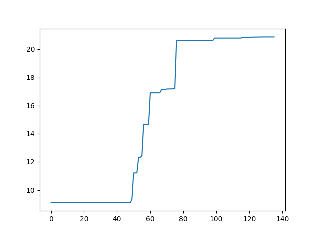

# gpu-logger

## Install

```
conda create -n gpulog python=3.11 -y
conda activate gpulog
pip install -r requirements.txt
```

## Usage

Save record with interval of 1 second and visualize for 1 gpu:

```
python main.py save_logs logs/gpu.jsonl --interval 1
python main.py visualize_logs logs/gpu.jsonl --device 1
# {'path': 'logs/gpu.png', 'device': 1, 'peak_memory': 20.885}
```



Example record:

```
{
  "time": 1629639339.0095732,
  "devices": [
    {
      "id": 0,
      "name": "Quadro RTX 8000",
      "mem_used": 36.842,
      "mem_total": 48.601,
      "util": 0.99
    },
    {
      "id": 1,
      "name": "Quadro RTX 8000",
      "mem_used": 0.003,
      "mem_total": 48.598,
      "util": 0.0
    }
  ],
  "processes": [
    {
      "device_id": 0,
      "user": "student",
      "name": "/home/anaconda3/envs/bin/python train.py",
      "uptime": "1-06:05:35",
      "pid": 18751,
      "mem_used": 36.839
    }
  ]
}
```
